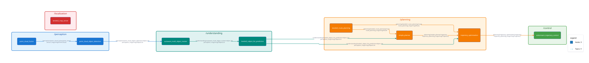
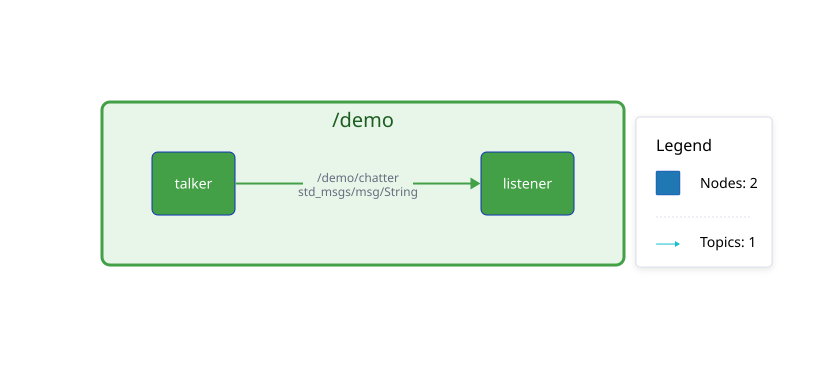

# ros2_graph_export

<p align="center">
  <a href="https://github.com/openads-project"></a>
  <a href="https://www.ros.org"></a>
  <a href="https://github.com/openads-project/ros2_graph_export/releases/latest"></a>
  <a href="https://github.com/openads-project/ros2_graph_export/blob/main/LICENSE"></a>
  <br>
  <a href="https://github.com/openads-project/ros2_graph_export/actions/workflows/docker-ros.yml"></a>
  <a href="https://github.com/openads-project/ros2_graph_export/actions/workflows/compose-oci.yml"></a>
  <a href="https://openads-project.github.io/ros2_graph_export"></a>
  <a href="https://github.com/openads-project/ros2_graph_export/actions/workflows/consistency.yml"></a>
</p>

**ROS 2 Node and Topic Graph Exporter**

The [`ros2_graph_export`](./ros2_graph_export/) node exports the current graph of ROS 2 nodes and topics to a [D2 diagram](https://d2lang.com/) definition file, auto-rendered to SVG. A sample export generated in the [OpenADStack](https://github.com/openads-project/openadstack) repository is shown below.



<p align="center">
  <strong>🚀 <a href="#-quick-start">Quick Start</a></strong> • <strong>💻 <a href="#-development">Development</a></strong> • <strong>📝 <a href="#-documentation">Documentation</a></strong>
</p>

> [!IMPORTANT]
> This repository is part of [***OpenADS***](https://openads-project.github.io/), the *Open Automated Driving Systems* project. *OpenADS* and its modules have been initiated and are currently being maintained by the [**Institute for Automotive Engineering (ika) at RWTH Aachen University**](https://www.ika.rwth-aachen.de/de/).

## 🚀 Quick Start

1. Launch the [`demo/docker-compose.yml`](demo/docker-compose.yml) setup. This will start a ROS 2 graph export node along with a dummy publisher and subscriber node.
    ```bash
    cd demo
    docker compose up -d
    ```
1. Check out the generated D2 diagram defined in [`demo/output/ros_graph.d2`](demo/output/ros_graph.d2) and the rendered SVG in [`demo/output/ros_graph.svg`](demo/output/ros_graph.svg).  
    <a href="./demo/output/ros_graph.svg" target="_blank"></a>
1. Stop the demo and clean up.
    ```bash
    docker compose down
    ```
1. If you would like to modify the D2 diagram, you can re-render it with the following command. A live preview of the diagram will be available at [http://localhost:8080](http://localhost:8080). Alternatively, you can also use the [D2 playground](https://play.d2lang.com/?script=zJLPjpswEMbvfoqRc2uXxBgSsj5U6gu0UrfHSojgMVhLcGRPuv0j3r0K-UcIkXrcE7Y_7PnNfN8MPu_JRRW26AtCDd--vkDli10NxrsteBdk3u9z_LVzntgMLj_nBSmQQq4ikUVSglipdKXS9KMQQrAZtE5jUCCfgNzOlkFB_ASoq8NhzJi2HkuyrlXgbVUTYz8LHxT8ZQBaRg1W2OrjFiDQ7wbnxjaNAj4za_NsDB8qrqWodI3zBz1J0ni5HOob5zX6yBfa7oOC9fhqsH9QQZz25ydw_uXUAD9BjDFik2WblN9qA5C32hLeqCOM1f3VE0jSK90VB6JPF67v53GOwQJ594o9WrbB0vCH78vL-x3rGPswf8B3Fm6H1IZc49Yp4IvD94hxOxtcmyU-czZtULxZohRXdcKeu7pSsPs-06QQacZHSvRmNdUKkkGBRisgv0fWnfHnjQ10CLMCfl5OtTKuMWXxQ3unMzYFGw_IqGhee67j4l1R9Um8n2CfhEVZF0Tof7SBdL4NVVhsQ7V4IW_batjF_zoo2XR6O_YvAAD__w%3D%3D&layout=elk&).
    ```bash
    docker run --rm -it -u "$(id -u):$(id -g)" -v "$PWD:/home/debian/src" -p 8080:8080 terrastruct/d2:v0.7.0 --layout elk --watch output/ros_graph.d2
    ```

## 💻 Development

### Set up Development Environment

1. Clone the repository.
    ```bash
    git clone https://github.com/openads-project/ros2_graph_export.git
    ```
1. Initialize the [`.openads-dev-environment`](https://github.com/openads-project/openads-dev-environment) submodule containing development environment configuration.
    ```bash
    cd ros2_graph_export
    git submodule update --init --recursive
    ```
1. Open the repository in [Visual Studio Code](https://code.visualstudio.com).
    ```bash
    code .
    ```
1. Install the recommended VS Code extensions.
    > *Ctrl+Shift+P / Extensions: Show Recommended Extensions / Install Workspace Recommended Extensions (Cloud Download Icon)*
1. Reopen the repository in a [Dev Container](https://code.visualstudio.com/docs/devcontainers/containers).
    > *Ctrl+Shift+P / Dev Containers: Rebuild and Reopen in Container*

### Build

> *Ctrl+Shift+B*

```bash
colcon build
```

### Run Tests

> *Ctrl+Shift+P / Tasks: Run Test Task*

```bash
colcon build --cmake-args -DCMAKE_EXPORT_COMPILE_COMMANDS=1
colcon test
colcon test-result --verbose
```


## 📝 Documentation

Package and node interfaces are documented in the respective package READMEs listed below. Implementation details are found in the [Source Code Documentation](https://openads-project.github.io/ros2_graph_export).

| Package | Description |
| --- | --- |
| [ros2_graph_export](ros2_graph_export/README.md) | Exports ROS node and topic graphs |

## ⚖️ Licensing

The source code in this repository is licensed under Apache-2.0, see [LICENSE](LICENSE). Container images provided by this repository may contain third-party software shipped with their own license terms.

## 🙏 Acknowledgements

Development and maintenance of this repository are supported by the following projects. We acknowledge the funding of the respective institutions.

| Project | Funding Institution | Grant Number |
| --- | --- | --- |
| [6GEM+](https://6gem.de/) | 🇩🇪 Federal Ministry for Research, Technology and Space (BMFTR) | 16KIS2409K |

<p>
  
</p>
