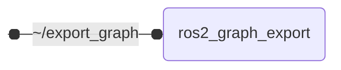

# `ros2_graph_export`

Exports ROS node and topic graphs

## Nodes

### `ros2_graph_export`

#### Service Servers

| Service | Type | Description |
| --- | --- | --- |
| `~/export_graph` | `std_srvs/srv/Trigger` | trigger graph export |

#### Parameters

| Parameter | Type | Default | Description |
| --- | --- | --- | --- |
| `output_path` | `string` | `str(Path.home() / ".ros" / "ros_graph.d2")` | graph export path |
| `export_interval_seconds` | `float` | `5.0` | graph export interval in seconds |
| `ignore_topics_without_publishers` | `bool` | `true` | ignore topics without publishers |
| `ignore_topics_without_subscribers` | `bool` | `true` | ignore topics without subscribers |
| `graph_direction` | `string` | `right` | layout direction of the exported graph: 'right' arranges nodes left-to-right, 'down' arranges them top-down for a more compact fit on A4 pages |
| `excluded_nodes` | `string[]` | `[]` | Nodes to exclude from the graph, as fully qualified names (/ns/node) or bare node names. Shell-style wildcards are supported, e.g. /debug/* or *_monitor. |

## Launch Files

### [`ros2_graph_export_launch.py`](launch/ros2_graph_export_launch.py)

| Argument | Default | Description |
| --- | --- | --- |
| `export_graph` | `"~/export_graph"` | service topic for triggering graph export |
| `name` | `"ros2_graph_export"` | node name |
| `namespace` | `""` | node namespace |
| `params` | `os.path.join(get_package_share_directory("ros2_graph_export"), "config", "params.yml")` | path to parameter file |
| `log_level` | `"info"` | ROS logging level (debug, info, warn, error, fatal) |
| `use_sim_time` | `"false"` | use simulation clock |
